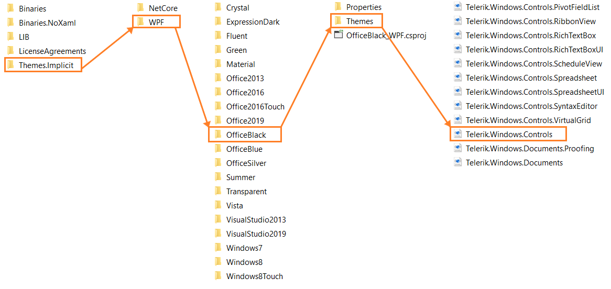
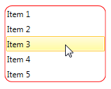
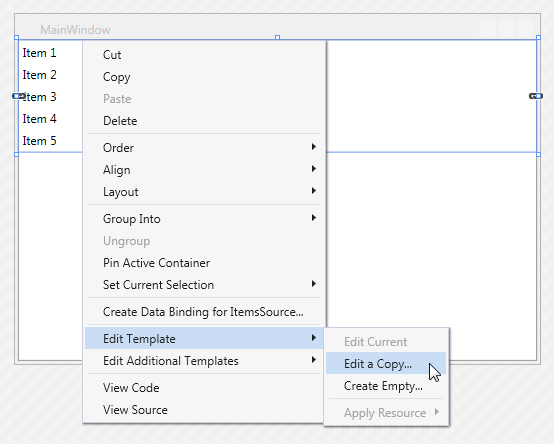
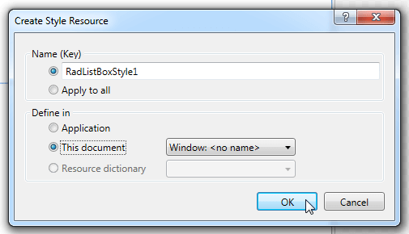
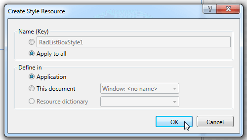

# Editing Control Templates

This article demonstrates two approaches on how to extract and edit the default control templates of the Telerik UI for {{ site.framework_name }} controls:

* [Extracting Control Templates Manually from the Theme XAML File](#extracting-control-templates-manually-from-the-theme-xaml-file)
* [Extracting Control Templates Using Visual Studio](#extracting-control-templates-using-visual-studio)

## Extracting Control Templates Manually from the Theme XAML File

The **XAML** files with the different themes for all controls are located in the __Themes.Implicit__ folder. You can find this folder in the Telerik UI for {{ site.framework_name }} installation directory, for example, `C:\Program Files (x86)\Progress\Telerik UI for WPF R2 2021\Themes.Implicit`.

> As of 2021 R2 release version, the folder **WPF40**'s name is changed to **WPF**. The .xaml files inside the folder are meant for **.NET Framework 4.0** and **.NET Framework 4.5**. A folder named **NetCore** was introduced, which targets the **.NET Core 3.1**, **.NET 5** and **.NET 6** frameworks. 

The following example shows how to extract the **RadListBox** control template for the **Office_Black** theme:

1. Navigate to the Telerik UI for {{ site.framework_name }} installation directory and open the **Themes.Implicit\WPF\OfficeBlack\Themes** folder.

   You can choose any of the available themes in the **WPF** folder. The folder names correspond to the theme names.

1. Locate the __Telerik.Windows.Controls.xaml__ file and open it with your favorite editor.

   To find the XAML file for any control, you need to know the name of the [assembly that contains the control](). The name of the XAML file corresponds to the name of the assembly.

   __Figure 1: Navigating to the required XAML file__

   

   >important Always extract the desired control template from the theme that you use in your application. For example, if your application uses the **Office Black** theme, extract the control template from the **Themes.Implicit\WPF\OfficeBlack\Themes** folder. The control templates are different for each theme. Using the wrong template may lead to errors or undesired behavior.

1. In the editor, find the default style for the **RadListBox** control. It is called **RadListBoxStyle**.

   The default styles follow the convention **name of the control + Style**, for example, **RadListBoxStyle**.

1. Under **RadListBoxStyle**, navigate to the value of the **Template** property setter, which points to the control template.

1. Copy the **RadListBox** control template from the XAML file.

Once you copy the template, you can modify it and apply it either to a single instance of the control or throughout your application by creating the desired style and setting its **Template** property.

>important When changing a __Control Template__, you must include all required parts. Even if your code compiles, some of the functionality may be impacted due to the omission of the required parts. The required parts are marked with the prefix "__PART___".

To add a rounded red border around the **RadListBox** control, follow the steps above to extract the control template. Then modify the control template as demonstrated in **Example 1** below.

#### __[XAML] Example 1: Adding a border around the RadListBox control__

{{region xaml-styling-apperance-editing-control-templates_0}}
	<Application.Resources>
	    <ResourceDictionary>
	        <ResourceDictionary.MergedDictionaries>
	            <ResourceDictionary Source="/Telerik.Windows.Themes.Office_Black;component/Themes/Telerik.Windows.Controls.xaml"/>
	        </ResourceDictionary.MergedDictionaries>
	        
	        
	    </ResourceDictionary>
	</Application.Resources>
{{endregion}}

#### __Figure 2: RadListBox control with red border__

## Extracting Control Templates Using Visual Studio


> Extracting control templates of the control using Visual Studio is only possible when the project reference XAML assemblies. In Silverlight, Visual Studio won't be able to obtain the default templates of the controls when the referenced DLLs are NoXAML.


Another way to extract a control template is to use the **Visual Studio designer** or **Expression Blend**:

1. Right-click the desired control and select __Edit Template__ in the context menu.

1. Click __Edit a Copy__ as shown in **Figure 3**.

   __Figure 3: Visual Studio designer context menu__

   

1. In the **Create Style Resource** dialog, select one of the following options:

   * To extract the style with the default control template in a specified document with a resource key.

      Choose this option if you need to apply the style to a single instance of the control.

      __Figure 4: Generating a style with a resource key__

      

   * To create an implicit style.

      __Figure 5: Generating an implicit style__

      

Let's assume you just need to style one specific instance of the control and you have chosen to extract the style with a resource key in the current document. **Example 2** shows the generated XAML code.

#### __[XAML] Example 2: The generated XAML code__

{{region styling-apperance-editing-control-templates_1}}
	<UserControl>
	    <UserControl.Resources>
	        
	    </UserControl.Resources>
	
	    <Grid>
	        <telerik:RadListBox Style="{StaticResource RadListBoxStyle1}" ItemsSource="{Binding ListBoxItems}" />
	    </Grid>
	<UserControl>
{{endregion}}

## See Also

 * [Setting a Theme]()
